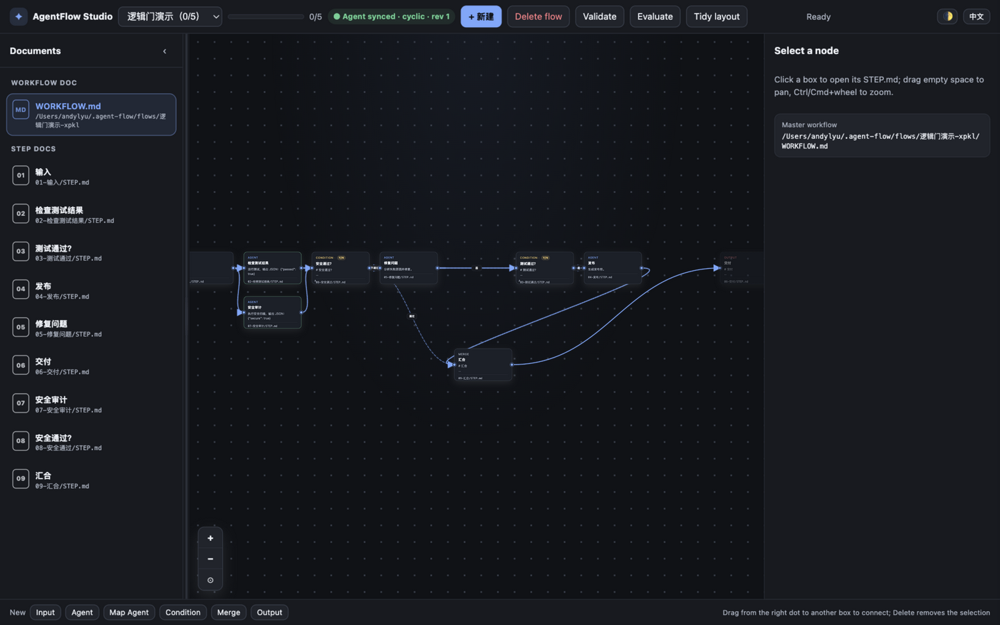
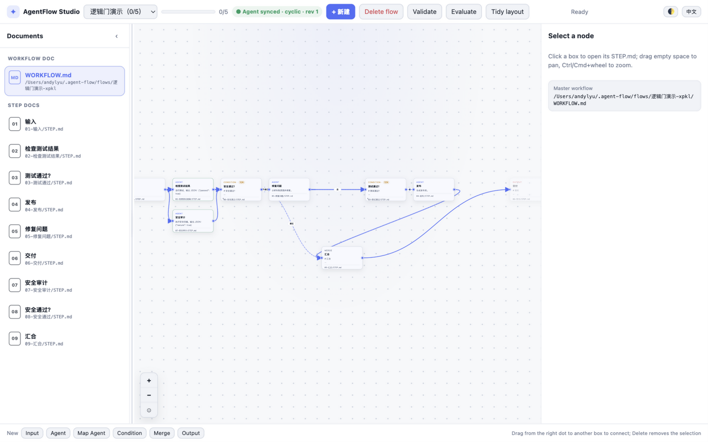
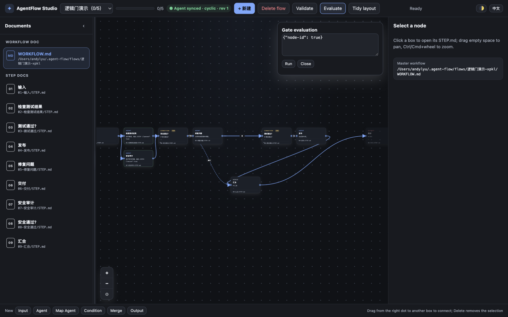
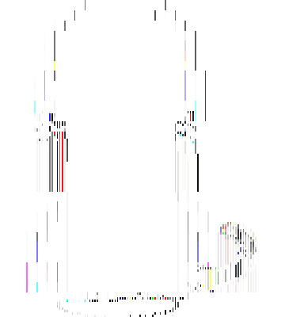

<h1 align="center">AgentFlow</h1>

<p align="center"><strong>See the workflow. Keep Markdown portable. Execute with deterministic gates.</strong></p>

<p align="center">A Markdown-first workflow CLI, visual Studio canvas, and desktop pet for any coding agent.</p>

<p align="center"><a href="https://agentflow.kanghelyu.org/">🌐 Official website — agentflow.kanghelyu.org</a></p>

<p align="center">
  <a href="https://github.com/kanghelyu/agent-flow/releases"></a>
  <a href="LICENSE"></a>
  <a href="https://github.com/kanghelyu/agent-flow"></a>
</p>

<p align="center"><strong>English</strong> · <a href="README.zh-CN.md">简体中文</a></p>

AgentFlow turns long agent sessions into step-by-step Markdown workflows. Each workflow is a `WORKFLOW.md` master document plus one `STEP.md` workspace per step; `flow.json` is derived metadata and `state.json` tracks execution. It works with **ZCode, Claude Code, Codex CLI, or a plain terminal** — no plugin host required.

It is deliberately an editor-plus-runtime: AgentFlow validates topology, evaluates Boolean gates deterministically, and keeps execution bookkeeping — the Agent itself performs the actual work in the current session.

<p align="center">
  
  
</p>

<p align="center">
  
  
</p>

## What it gives you

- **Markdown as the source of truth** — one master `WORKFLOW.md`, plus one `STEP.md` workspace for each step; `af render` rebuilds the structure block after manual edits.
- **A real visual canvas** — create, move, connect, reconnect, label, and delete nodes and arrows; bilingual UI with light/dark themes.
- **Deterministic logic gates** — eight gate types (IF/ELSE, AND, OR, NOT, NAND, NOR, XOR, XNOR) with strict `truthy` / `falsy` / `nonEmpty` predicates. Branching is decided by a truth table, not an LLM vibe check.
- **A real execution runtime** — `af next` returns only READY Agent nodes; `af done --result` automatically resolves conditions, merges branches, marks skipped paths, and emits the next batch. Stale submissions are rejected via revision + execution fingerprints.
- **Explicit control loops** — "check fails → fix → check again" is allowed as an explicit loop with a documented exit condition; the Runtime propagates in a stable order for a finite number of rounds and stays waiting instead of running forever.
- **Resumable bookkeeping** — `next / done / undo / status / evaluate` give session-less agents an explicit sense of progress; blocked and ready steps are computed, not guessed.
- **A desktop pet that watches your flow** — an optional pixel-art Tuxedo cat polls the local Studio every 1.8 s and reacts to `idle / working / done / error`; right-click menu for size, coat, play area, low-power mode, and more.
- **Cross-platform installers** — `install.sh` for macOS/Linux and `install.ps1` for Windows; skills are dropped into ZCode, Claude Code, and Codex directories automatically.

## Quick start

Requirements: Node.js 18 or newer and npm.

macOS / Linux:

```bash
bash install.sh
af --version
af doctor
```

Windows PowerShell:

```powershell
Set-ExecutionPolicy -Scope Process Bypass
.\install.ps1
af --version
af doctor
```

Start the browser Studio without opening a browser automatically:

```bash
af studio --no-open
```

The default storage root is `~/.agent-flow` (override with `AF_HOME` or `--root`). Studio binds to `127.0.0.1:4317`; use `--port` or `AF_STUDIO_PORT` when that port is taken.

## Your first workflow

```bash
af create "Fix the login issue" \
  --desc "Identify the cause, implement the fix, and pass tests" \
  --steps "Reproduce issue;Identify root cause;Implement fix;Run tests;Final acceptance"
af validate <flow-id>
af studio
```

A typical workflow directory looks like this:

```text
~/.agent-flow/flows/<flow-id>/
├── WORKFLOW.md
├── 01-reproduce-issue/
│   └── STEP.md
├── 02-identify-root-cause/
│   └── STEP.md
├── 03-implement-fix/
│   └── STEP.md
├── 04-run-tests/
│   └── STEP.md
├── 05-final-acceptance/
│   └── STEP.md
├── flow.json
└── state.json
```

## Command reference

| Command | Purpose |
| --- | --- |
| `af create <name> --steps "A;B;C"` | Create a linear workflow. |
| `af create --json flow.json` | Import a complete workflow definition (DeepSeek Flow JSON is compatible). |
| `af list` / `af read <id>` | Discover workflows; read the master document, step documents, revision, graph, and logic contract. |
| `af validate <id>` | Deterministic structure / connectivity / gate-semantics validation. |
| `af evaluate <id> --values '{...}'` | Diagnostic truth-table evaluation; never advances the Runtime. |
| `af next <id> --json` | Compile the latest revision and return only READY Agent nodes. |
| `af done <id> <nodeId> --result '{...}' --revision <rev>` | Commit a structured result; the Runtime resolves gates automatically. |
| `af result <id> <nodeId> '{...}'` | Attach or update a node result. |
| `af undo <id> <nodeId>` | Clear a node and its downstream completion/results. |
| `af status <id>` | Progress overview: done / ready / blocked / skipped / gates. |
| `af render <id>` | Rebuild the `WORKFLOW.md` structure block after manual edits. |
| `af delete <id> --yes` | Archive-delete into `<root>/trash/` (recoverable). |
| `af studio [--port N] [--no-open]` | Start the local canvas (default `127.0.0.1:4317`). |
| `af doctor [--json]` | Check Node, storage root, Studio assets, and installed agent skills. |

## Logic gates

Condition boxes support eight gate types. Gate metadata controls connection labels, outgoing limits, and the Boolean contract exported to the Runtime.

| Gate | Connection behavior | Boolean result |
| --- | --- | --- |
| **IF / ELSE** | One **Yes** and one **No** branch at most. | Selects exactly the branch matching the condition result. |
| **AND / NAND** | At least two incoming edges. | All operands must be true (NAND negates). |
| **OR / NOR** | At least two incoming edges. | Any operand true (NOR negates). |
| **XOR / XNOR** | At least two incoming edges. | Odd number of true inputs (XNOR negates). |
| **NOT** | Exactly one incoming edge. | Negates its single input. |

Duplicate node/edge IDs, dangling edges, self-loops, duplicate Yes/No branches, excess IF/ELSE or NOT arrows, invalid aggregate arity, unreachable nodes, and natural-language predicates are rejected with actionable validation messages. Explicit control loops are allowed when their exit condition, maximum attempt count, or manual stop mechanism is documented in the Markdown; the Runtime propagates them in a stable order for a finite number of rounds.

```json
{
  "id": "confirmed",
  "kind": "condition",
  "data": { "label": "Confirmed?", "gateType": "ifElse", "predicate": "truthy" }
}
```

## Execution model

The AgentFlow Runtime **does not perform Agent steps for you**, but it automatically executes Condition / Merge and persists branch state:

```text
af next → read STEP.md → do the work → af done --result → Runtime resolves gates → next batch
```

- `af next` returns the current `flowRevision`, READY nodes, gate state, `edgeStates`, and `skipped` paths.
- `af done --result` saves `results[nodeId]`, evaluates resolvable conditions, writes active/inactive edges, marks skipped branches, handles Merge, and recalculates the next batch.
- If Studio changes the current node or an upstream node mid-work, the old submission returns `STALE_WORKFLOW` — discard it and run `af next` again. Unrelated branch changes are tolerated via execution fingerprints.
- `af evaluate` is a stateless diagnostic; do not treat it as part of the execution loop.

## Desktop pet

The pet is optional — the CLI and browser Studio work without Electron.

macOS / Linux:

```bash
~/.agent-flow/studio-pet/run-pet.sh
```

Windows PowerShell:

```powershell
& "$HOME\.agent-flow\studio-pet\run-pet.ps1"
```

First launch can install the pinned Electron runtime into `studio-pet/node_modules`; set `AF_ELECTRON` to use an existing Electron instead. Right-click menu: size (`0.2x–3.0x`), coat (14 colors), play area, low-power mode, always-on-top, language, open, quit. Dragging the pet never raises the Studio window. Linux transparency, tray icons, and always-on-top depend on the desktop environment; X11 is generally more predictable than Wayland.

## Open-source components

AgentFlow is MIT licensed, and it builds on two open-source projects:

- **DeepSeek Flow core modules** — the workflow core (`document-workflow.js`, `condition-gates.js`, `flow-validation.js`, `logic-semantics.js`) is extracted from [kanghelyu/dsh-deepseek-flow](https://github.com/kanghelyu/dsh-deepseek-flow) (MIT). The files share the same DAG validation, Boolean-gate semantics, and Markdown layout, so `flow.json` produced by either side is interchangeable: dsh-exported JSON can be imported with `af create --json`, and af's `flow.json` can be handed to `dsh flow_put`.
- **pixelpets** — the desktop pet shell (`studio-pet/`) is adapted from [JOhnsonKC201/pixelpets](https://github.com/JOhnsonKC201/pixelpets) (MIT): a pixel-art cat overlay, stripped to cat-only plus the AgentFlow status bridge. See `studio-pet/ATTRIBUTION.md` for the full license text and a detailed what-we-kept / what-we-stripped list.

## Design boundaries

AgentFlow deliberately does **not** provide:

- model calls, tool execution, or credentials of any kind — the Agent does the work;
- triggers, schedules, webhooks, or hosted execution;
- a lock-in database — Markdown is the source of truth and `flow.json` is derived metadata.

That boundary keeps it portable: the same workflow directory works with ZCode, Claude Code, Codex CLI, or a plain shell.

## Local development

```bash
git clone https://github.com/kanghelyu/agent-flow.git
cd agent-flow
node bin/af.mjs --version
```

Useful checks:

```bash
npm run check
npm test
ELECTRON_BIN=<path-to-electron> npm run test:pet-size
```

<details>
<summary>Repository layout</summary>

```text
agent-flow/
├── bin/                 af CLI entry point
├── lib/                 Workflow core: validation, gates, runtime, document sync
├── skills/              Bundled agent skill (SKILL.md)
├── studio/              Local Studio canvas (HTTP + SSE, zero dependencies)
├── studio-pet/          Optional desktop pet (Electron shell from pixelpets)
├── install.sh           macOS / Linux installer
├── install.ps1          Windows installer
├── test/                CLI and Studio contract tests
└── docs/shots/          README screenshots
```

</details>

## Troubleshooting

- **`af` is not found:** add `~/.local/bin` to `PATH`, or run `node ~/.agent-flow/bin/af.mjs`.
- **The Studio tab does not open:** run `af studio --no-open` and visit the printed URL, or pass another `--port`.
- **The pet does not start:** run `af studio --no-open` first and check `127.0.0.1`; on Linux prefer an X11 session; set `AF_ELECTRON` if npm cannot download Electron.
- **`af done` returns `STALE_WORKFLOW`:** discard the old submission and run `af next <id>` again.
- **`af validate` rejects a retry loop:** model it as an explicit control loop with a documented exit condition, or as a bounded retry step with a terminal failure branch.
- **The pet menu is in the wrong language:** use the Language submenu (Follow system / 中文 / English).
- **Recovering a deleted workflow:** archived flows live under `<root>/trash/<timestamp>-<id>/`; copy the directory back into `flows/`.

## Uninstall

```bash
rm -rf ~/.agent-flow ~/.local/bin/af
rm -rf ~/.zcode/skills/agent-flow ~/.claude/skills/agent-flow "$CODEX_HOME/skills/agent-flow"
```

Pet settings live in Electron's platform userData directory (`~/Library/Application Support/agent-flow-studio-pet` on macOS, `%APPDATA%\agent-flow-studio-pet` on Windows) and are separate from CLI workflow data.

## License

[MIT](LICENSE). The desktop pet shell includes the MIT-licensed [pixelpets](https://github.com/JOhnsonKC201/pixelpets) project; see [ATTRIBUTION.md](ATTRIBUTION.md).
