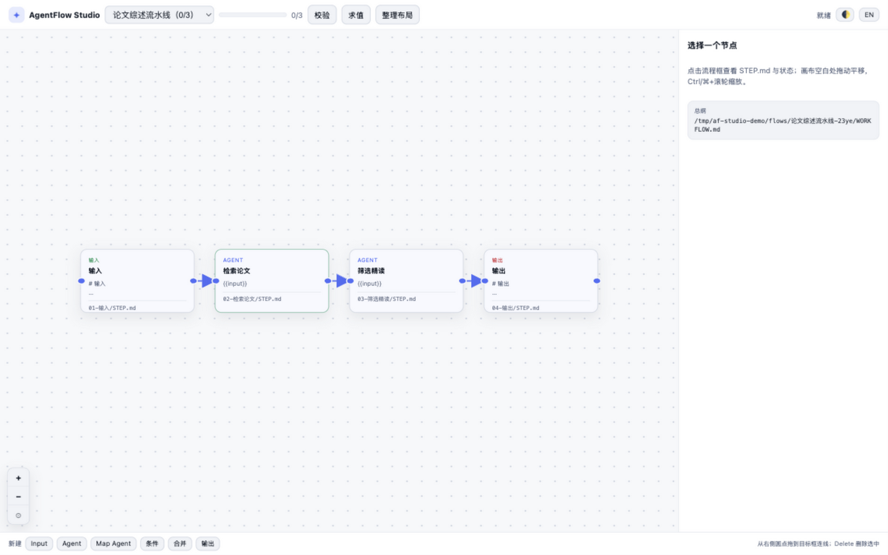

# AgentFlow (`af`) — Markdown-first workflows with a visual studio, for every coding agent

[English](README.md) · [简体中文](README.zh-CN.md)

Turn long agent sessions into **step-by-step Markdown workflows** with deterministic Boolean gates, a zero-dependency CLI, a live visual canvas (Studio), and an optional desktop pet window. Works with any agent — ZCode, Claude Code, Codex CLI, DeepSeek Harness — or a plain shell.

```
af next <id> → read STEP.md → do the work in your agent session → af done <id> <nodeId> → loop → af validate
```


- **Markdown is the single source of truth** — every step is a `STEP.md` you can read, edit, diff and commit. `flow.json` is derived metadata, not a lock-in database.
- **Deterministic logic gates** — `ifElse / and / or / not / nand / nor / xor / xnor` with strict predicates (`truthy / falsy / nonEmpty`). Branching is verified by a truth table, never by an LLM vibe check.
- **Visual Studio** — `af studio` serves an interactive canvas on `127.0.0.1`: drag nodes, connect edges, pick branches, edit `STEP.md` inline, evaluate gates, watch the agent's file edits refresh live over SSE.
- **Desktop pet mode** — a tiny always-on-top progress card that expands into the full canvas. Reuses the clawd-on-desk Electron runtime if present, falls back to app-mode Chrome elsewhere.
- **Zero dependencies, three platforms** — pure Node ESM (≥ 18). No native modules, no platform calls, Chinese flow names welcome. macOS / Linux / Windows.



## Why

Agents lose the plot on long tasks: plans live in ephemeral chat context, progress state is "trust me", and branching logic is a prompt. AgentFlow keeps the plan on disk as reviewable Markdown, keeps progress in explicit `done` bookkeeping, and keeps branching in gates whose semantics a static validator can prove (acyclic, connected, gate arity, truth-table determinism).

It is the portable core of [DeepSeek Flow](https://github.com/kanghelyu/dsh-deepseek-flow) (the visual workflow editor plugin for DeepSeek Harness). Five modules are shared verbatim between the two projects, so `flow.json`, the `WORKFLOW.md` structure block and gate semantics are **fully interoperable**: export from dsh and `af create --json`, or point dsh's `flow_put` at an af flow and it opens on the canvas.

| Shared module | Responsibility |
| --- | --- |
| `lib/condition-gates.js` | eight gate types, branch-alias normalization |
| `lib/logic-semantics.js` | truth tables, predicates, gate execution contract |
| `lib/flow-validation.js` | acyclic / connected / IO / gate-semantic validation |
| `lib/topology-model.js` | topology projection & signature |
| `lib/document-workflow.js` | WORKFLOW.md / STEP.md generation & structure blocks |

AgentFlow adds what a session-less agent needs: execution bookkeeping (`next` / `done` / `undo` / `status`), a standalone Studio server, and a bundled agent skill that teaches any agent the gate rules.

## Install

**macOS / Linux**

```bash
bash install.sh          # CLI → ~/.agent-flow, skill → detected agent dirs
```

**Windows** (PowerShell)

```powershell
powershell -ExecutionPolicy Bypass -File install.ps1
```

The installer creates an `af.cmd` shim and tries to place it on your PATH; otherwise add `%USERPROFILE%\.agent-flow\bin` to PATH.

Manual install (all platforms):

```bash
# macOS / Linux
mkdir -p ~/.agent-flow/bin ~/.agent-flow/lib
cp lib/*.js ~/.agent-flow/lib/ && cp bin/af.mjs ~/.agent-flow/bin/
ln -sf ~/.agent-flow/bin/af.mjs /usr/local/bin/af
# skill: skills/agent-flow/SKILL.md → ~/.zcode/skills/ or ~/.claude/skills/ or ~/.codex/skills/
```

```powershell
# Windows (PowerShell)
$af = "$env:USERPROFILE\.agent-flow"
foreach ($s in "bin","lib","flows","trash") { New-Item -ItemType Directory -Force -Path "$af\$s" | Out-Null }
Copy-Item lib\*.js "$af\lib"; Copy-Item bin\af.mjs "$af\bin"
Set-Content "$af\bin\af.cmd" "@echo off`r`nnode `"$af\bin\af.mjs`" %*"
```

Notes: pure Node ESM with zero dependencies — Windows / Linux / macOS all run the same code (paths go through `node:path`). On Windows prefer PowerShell for `--values` JSON quoting, and launch via `af.cmd` or `node af.mjs` (shebangs don't execute on cmd). Node ≥ 18 (`import.meta.dirname` in tests needs 20.11+).

## Quick start

```bash
af create release-check --steps "lint;tests;changelog;publish"
af next release-check          # prints the ready step + its STEP.md path
#   ... let your agent do the step ...
af done release-check <nodeId> # or: af done release-check lint
af status release-check
```

Branching:

```bash
af create --json flow.json     # full definition incl. gates, dsh-export compatible
af evaluate myflow --values '{"approved":true}'   # truth-table evaluation + active targets
```

Storage root defaults to `~/.agent-flow`; override with `--root` or `AF_HOME`. For per-project flows use `--root .af` (commit the Markdown, ignore `state.json`).

## Command reference

| Command | Purpose |
| --- | --- |
| `af create <name> --steps "a;b;c"` | linear workflow (or 4-step scaffold by default) |
| `af create --json flow.json` | import full definition incl. logic gates |
| `af list` / `af read <id>` | index & progress / full outline + all STEP.md + gate contract |
| `af validate <id>` | acyclic, connected, gate-semantics check (no model calls) |
| `af evaluate <id> --values '{...}'` | gate truth evaluation & active targets |
| `af next <id>` / `af done <id> <node>` / `af undo` | execution navigation & bookkeeping |
| `af status <id>` | done / todo / blocked overview |
| `af render <id>` | rebuild structure block after hand-editing Markdown |
| `af delete <id> --yes` | archive-delete (recoverable from trash) |
| `af studio [--app] [--port N]` | visual canvas server (default 127.0.0.1:4317) |

## Studio — the visual canvas

```bash
af studio              # zero-dependency local server + open in default browser
af studio --app        # Chrome app mode (standalone window, no address bar)
```

The canvas speaks the same visual language as DeepSeek Flow: node cards with kind colors, bezier arrows with Yes/No branch labels, gate chips with truth formulas, ready/done badges, ⌘/Ctrl+wheel zoom, two-finger pan, drag-to-connect (IF/ELSE pops a branch picker), an inline inspector that edits `STEP.md` and saves immediately, an evaluate panel, and SSE live sync — when the agent edits files in the terminal, the canvas refreshes within ~1s. Every topology mutation is validated before it touches disk: cycles, gate-arity violations and duplicate edges are rejected on the spot; "unreachable node" is allowed as an intermediate editing state and only flagged by the strict Validate button / `af validate`.

Bilingual UI (中文/English toggle) and light/dark themes are built in; both persist per browser.


### Desktop pet (floating window)

```bash
studio-pet/run-pet.sh        # macOS: double-click run-pet.command works too
```

A tiny always-on-top card (flow name + progress bar + next step) that expands into the full canvas window on click. It reuses the Electron binary already installed by clawd-on-desk — zero extra downloads — and runs the Studio server in-process (no child processes). Deep clawd integration (hosting the pet inside the clawd pet window, LaunchAgent autostart) is documented in [`studio-pet/HOST-WITH-CLAWD.md`](studio-pet/HOST-WITH-CLAWD.md). Without Electron, everything except the floating window still works via `af studio` in a browser.

## Gate rules (hard rules, shared with dsh)

- Gate types: `ifElse / and / or / not / nand / nor / xor / xnor`; predicates restricted to `truthy / falsy / nonEmpty`.
- **Never** put natural language in a predicate. Have the upstream agent step output a boolean, then feed a gate with `predicate: "truthy"`.
- `ifElse` / `not` take exactly one input; aggregating gates take ≥ 2; the graph must be acyclic.

## Bundled agent skill

`skills/agent-flow/SKILL.md` teaches any skill-capable agent (ZCode / Claude Code / Codex CLI) when to create flows, the gate JSON contract, the exact `af` commands per situation, and the common errors table. Installers copy it into detected agent skill directories.

## Testing

```bash
node --test test/cli.test.mjs test/studio.test.mjs
```

## Uninstall

```bash
rm -rf ~/.agent-flow ~/.zcode/skills/agent-flow ~/.claude/skills/agent-flow ~/.codex/skills/agent-flow /usr/local/bin/af
```

MIT License. Website: <https://agentflow.kanghelyu.org> · Related: [dsh-deepseek-flow](https://github.com/kanghelyu/dsh-deepseek-flow)
