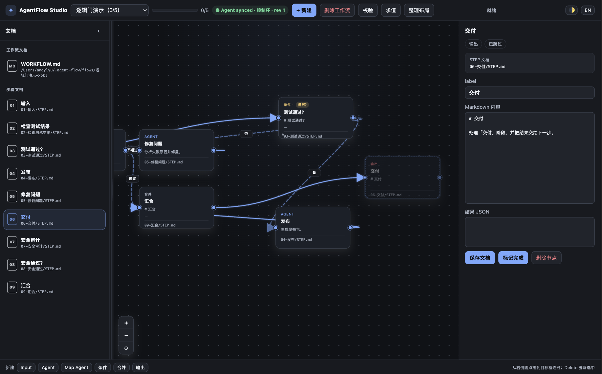
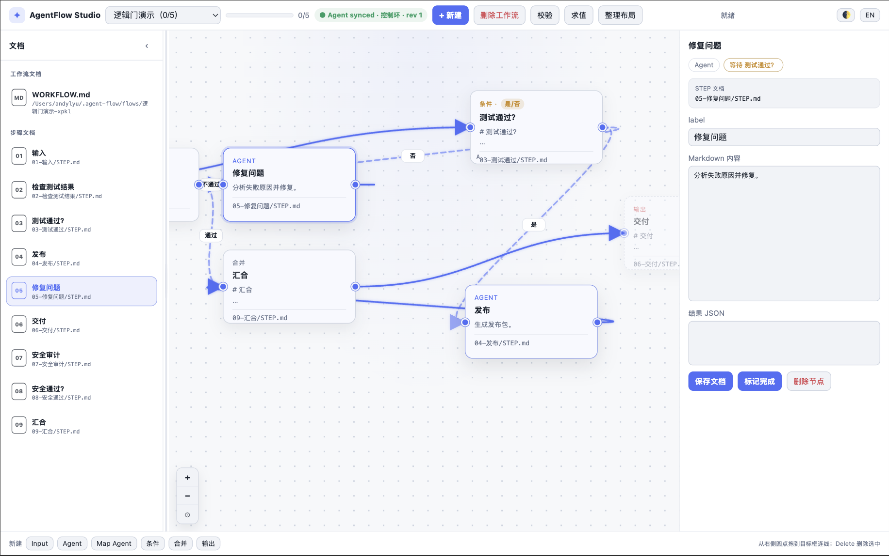
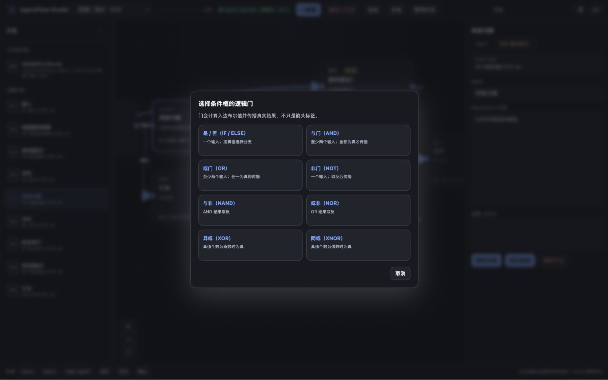

<h1 align="center">AgentFlow</h1>

<p align="center"><strong>看得到的工作流。可移植的 Markdown。确定性的布尔门。</strong></p>

<p align="center">面向任何编码代理的 Markdown-first 工作流 CLI、可视化 Studio 画布与桌面小宠。</p>

<p align="center"><a href="https://agentflow.kanghelyu.org/">🌐 官方网站 — agentflow.kanghelyu.org</a></p>

<p align="center">
  <a href="https://github.com/kanghelyu/agent-flow/releases"></a>
  <a href="LICENSE"></a>
  <a href="https://github.com/kanghelyu/agent-flow"></a>
</p>

<p align="center"><a href="README.md">English</a> · <strong>简体中文</strong></p>

## 推荐安装：把这个仓库交给你的 Agent

AgentFlow 最好的安装方式，是**把本仓库链接直接交给你的编码代理**（或在对话里粘贴这个地址），让它自己执行安装：

```text
https://github.com/kanghelyu/agent-flow
```

AgentFlow 是一个**不绑定 Agent 宿主**的插件：同一份仓库同时适用于 ZCode、Claude Code、Codex CLI、Cursor、Windsurf 等任何能执行终端命令的代理，且支持 macOS、Windows、Linux。你的 Agent 会：

1. 克隆或获取本仓库；
2. 运行 `install.sh`（macOS/Linux）或 `install.ps1`（Windows）；
3. 把 `agent-flow` 技能放进自己的技能目录（以及它能找到的其他代理技能目录）；
4. 用 `af --version` 和 `af doctor` 完成验证。

不需要插件市场、不需要针对特定宿主打包、不需要手动复制技能文件。只要你的 Agent 能跑终端命令，就能装上 AgentFlow。

AgentFlow 把冗长的 Agent 会话变成逐步的 Markdown 工作流。每个工作流是一个 `WORKFLOW.md` 总纲 + 每个步骤一个 `STEP.md` 工作区；`flow.json` 是派生元数据，`state.json` 记录执行进度。它同时适用于 **ZCode、Claude Code、Codex CLI 或普通终端**——不需要任何插件宿主。

它刻意同时是编辑器与运行时：AgentFlow 校验拓扑、确定性地求值布尔门、维护执行簿记——真正的干活仍由当前会话里的 Agent 完成。

<p align="center">
  
  
</p>

<p align="center">
  
  
</p>

## 它能给你什么

- **Markdown 是唯一事实来源** —— 一个总纲 `WORKFLOW.md`，每个步骤一个 `STEP.md` 工作区；手工改完文档后用 `af render` 重建结构块。
- **真正的可视化画布** —— 创建、移动、连接、改连、重命名、删除节点与箭头；内置中英双语与浅暗双主题。
- **确定性逻辑门** —— 八种门（IF/ELSE、AND、OR、NOT、NAND、NOR、XOR、XNOR）配合严格的 `truthy` / `falsy` / `nonEmpty` 谓词。分支由真值表决定，而不是模型“感觉”。
- **真正的执行运行时** —— `af next` 只返回 READY 的 Agent 节点；`af done --result` 自动求解条件、合并分支、标记跳过路径并输出下一批。旧提交通过修订号 + 执行指纹被拒绝。
- **显式控制环** —— “检查失败 → 修复 → 再检查”可以建模为带退出条件的显式环；运行时按稳定顺序有限轮传播，不收敛就保持等待，而不是永远跑下去。
- **可恢复的执行簿记** —— `next / done / undo / status / evaluate` 给无会话 Agent 明确的进度感；阻塞与就绪步骤是算出来的，不是猜的。
- **一只看着你流程跑的桌宠** —— 可选的像素黑白猫每 1.8 秒轮询本地 Studio，对 `idle / working / done / error` 做出反应；右键菜单含大小、毛色、游玩区域、节能等。
- **跨平台安装器** —— macOS/Linux 用 `install.sh`，Windows 用 `install.ps1`；技能自动放进 ZCode、Claude Code、Codex 目录。

## 快速开始

要求：Node.js 18 或更高版本，以及 npm。

macOS / Linux：

```bash
bash install.sh
af --version
af doctor
```

Windows PowerShell：

```powershell
Set-ExecutionPolicy -Scope Process Bypass
.\install.ps1
af --version
af doctor
```

不自动打开浏览器地启动 Studio：

```bash
af studio --no-open
```

默认存储根是 `~/.agent-flow`（可用 `AF_HOME` 或 `--root` 覆盖）。Studio 默认绑定 `127.0.0.1:4317`；端口被占用时用 `--port` 或 `AF_STUDIO_PORT`。

## 你的第一个工作流

```bash
af create "修复登录问题" \
  --desc "定位原因、实施修复并通过测试" \
  --steps "复现问题;定位根因;实施修复;运行测试;最终验收"
af validate <flow-id>
af studio
```

典型的工作流目录长这样：

```text
~/.agent-flow/flows/<flow-id>/
├── WORKFLOW.md
├── 01-reproduce-issue/
│   └── STEP.md
├── 02-identify-root-cause/
│   └── STEP.md
├── 03-implement-fix/
│   └── STEP.md
├── 04-run-tests/
│   └── STEP.md
├── 05-final-acceptance/
│   └── STEP.md
├── flow.json
└── state.json
```

## 命令参考

| 命令 | 作用 |
| --- | --- |
| `af create <name> --steps "A;B;C"` | 创建线性工作流。 |
| `af create --json flow.json [--lang zh\|en]` | 导入完整工作流定义（DeepSeek Flow JSON 兼容；可指定文档语言）。 |
| `af list` / `af read <id>` | 列出工作流；读取总纲、步骤文档、修订号、图与逻辑契约。 |
| `af validate <id>` | 确定性的结构 / 连通 / 门语义校验。 |
| `af evaluate <id> --values '{...}'` | 诊断用真值表求值；不推进运行时。 |
| `af next <id> --json` | 编译最新修订，只返回 READY 的 Agent 节点。 |
| `af done <id> <nodeId> --result '{...}' --revision <rev>` | 提交结构化结果；运行时自动求解门。 |
| `af result <id> <nodeId> '{...}'` | 附加或更新节点结果。 |
| `af undo <id> <nodeId>` | 撤销该节点及其下游的完成/结果。 |
| `af status <id>` | 进度总览：完成 / 就绪 / 阻塞 / 跳过 / 门。 |
| `af render <id>` | 手工改文档后重建 `WORKFLOW.md` 结构块。 |
| `af delete <id> --yes` | 归档删除到 `<root>/trash/`（可恢复）。 |
| `af studio [--port N] [--no-open]` | 启动本地画布（默认 `127.0.0.1:4317`）。 |
| `af doctor [--json]` | 检查 Node、存储根、Studio 资产与已装技能。 |

## 逻辑门

条件框支持八种门类型。门元数据控制连线标签、出边数量与导出给运行时的布尔契约。

| 门 | 连线行为 | 布尔结果 |
| --- | --- | --- |
| **IF / ELSE** | 至多一条 **是** 与一条 **否** 分支。 | 精确选择与条件结果匹配的分支。 |
| **AND / NAND** | 至少两条入边。 | 所有操作数必须为真（NAND 取反）。 |
| **OR / NOR** | 至少两条入边。 | 任一操作数为真（NOR 取反）。 |
| **XOR / XNOR** | 至少两条入边。 | 真值个数为奇数（XNOR 取反）。 |
| **NOT** | 恰好一条入边。 | 对单个输入取反。 |

重复节点/边 ID、悬空边、自环、重复的是/否分支、多余的 IF/ELSE 或 NOT 箭头、聚合门输入数量非法、不可达节点、自然语言谓词都会被带有可操作提示的校验拒绝。显式控制环允许存在，前提是其在 Markdown 中写明了退出条件、最大尝试次数或人工终止方式；运行时按稳定顺序有限轮传播。

```json
{
  "id": "confirmed",
  "kind": "condition",
  "data": { "label": "确认通过？", "gateType": "ifElse", "predicate": "truthy" }
}
```

## 执行模型

AgentFlow 运行时**不替你执行 Agent 步骤**，但会自动执行 Condition / Merge 并持久化分支状态：

```text
af next → 读 STEP.md → 干活 → af done --result → 运行时求解门 → 下一批
```

- `af next` 返回当前 `flowRevision`、READY 节点、门状态、`edgeStates` 与 `skipped` 路径。
- `af done --result` 保存 `results[nodeId]`、求解可解条件、写入激活/未激活边、标记跳过分支、处理 Merge，并重算下一批 READY 节点。
- 如果干活期间 Studio 改了当前节点或其上游节点，旧提交会返回 `STALE_WORKFLOW`——丢弃它，重新 `af next`。无关分支的改动通过执行指纹容忍。
- `af evaluate` 是无状态诊断，不要把它当执行循环的一部分。

## 桌面小宠

桌宠是可选组件——CLI 与浏览器 Studio 不依赖 Electron。

macOS / Linux：

```bash
~/.agent-flow/studio-pet/run-pet.sh
```

Windows PowerShell：

```powershell
& "$HOME\.agent-flow\studio-pet\run-pet.ps1"
```

首次启动可在 `studio-pet/node_modules` 安装固定版本 Electron；也可用 `AF_ELECTRON` 指向已有 Electron。右键菜单：大小（`0.2x–3.0x`）、毛色（14 种）、游玩区域、节能模式、始终置顶、语言、打开、退出。拖动小宠不会把 Studio 窗口带到前台。Linux 的透明、托盘与置顶能力取决于桌面环境；X11 通常比 Wayland 更可预期。

## 开源组件

AgentFlow 采用 MIT 许可，并基于两个开源项目：

- **DeepSeek Flow 核心模块** —— 工作流核心（`document-workflow.js`、`condition-gates.js`、`flow-validation.js`、`logic-semantics.js`）提取自 [kanghelyu/dsh-deepseek-flow](https://github.com/kanghelyu/dsh-deepseek-flow)（MIT）。两者共享同一套 DAG 校验、布尔门语义与 Markdown 布局，因此任一侧产出的 `flow.json` 可以互换：dsh 导出的 JSON 可用 `af create --json` 导入，af 的 `flow.json` 也可交给 `dsh flow_put`。
- **pixelpets** —— 桌宠外壳（`studio-pet/`）改编自 [JOhnsonKC201/pixelpets](https://github.com/JOhnsonKC201/pixelpets)（MIT）：像素猫悬浮层，裁剪到只剩猫并接入 AgentFlow 状态桥。完整许可文本与保留/删除清单见 `studio-pet/ATTRIBUTION.md`。

## 设计边界

AgentFlow 刻意**不**提供：

- 任何模型调用、工具执行或凭据——干活的是 Agent；
- 触发器、定时任务、webhook 或托管执行；
- 绑定型数据库——Markdown 是唯一事实来源，`flow.json` 是派生元数据。

这个边界让它保持可移植：同一份工作流目录在 ZCode、Claude Code、Codex CLI 或普通 shell 下都能用。

## 本地开发

```bash
git clone https://github.com/kanghelyu/agent-flow.git
cd agent-flow
node bin/af.mjs --version
```

常用检查：

```bash
npm run check
npm test
ELECTRON_BIN=<path-to-electron> npm run test:pet-size
```

<details>
<summary>仓库布局</summary>

```text
agent-flow/
├── bin/                 af CLI 入口
├── lib/                 工作流核心：校验、门、运行时、文档同步
├── skills/              随附 Agent 技能（SKILL.md）
├── studio/              本地 Studio 画布（HTTP + SSE，零依赖）
├── studio-pet/          可选桌面小宠（基于 pixelpets 的 Electron 外壳）
├── examples/            示例工作流（含英文逻辑门演示）
├── install.sh           macOS / Linux 安装器
├── install.ps1          Windows 安装器
├── test/                CLI 与 Studio 契约测试
└── docs/shots/          README 截图
```

</details>

## 故障排查

- **找不到 `af`**：把 `~/.local/bin` 加入 `PATH`，或直接 `node ~/.agent-flow/bin/af.mjs`。
- **Studio 标签页打不开**：先 `af studio --no-open` 访问打印的 URL，或换一个 `--port`。
- **小宠起不来**：先 `af studio --no-open` 确认 `127.0.0.1` 可达；Linux 优先 X11 会话；npm 下载不了 Electron 就设 `AF_ELECTRON`。
- **`af done` 返回 `STALE_WORKFLOW`**：丢弃旧提交，重新 `af next <id>`。
- **`af validate` 拒绝重试环**：把它建模成带退出条件的显式控制环，或带终止失败分支的有界重试步骤。
- **小宠菜单语言不对**：用语言子菜单（跟随系统 / 中文 / English）。
- **恢复已删除的工作流**：归档在 `<root>/trash/<时间戳>-<id>/`，把目录拷回 `flows/` 即可。

## 卸载

```bash
rm -rf ~/.agent-flow ~/.local/bin/af
rm -rf ~/.zcode/skills/agent-flow ~/.claude/skills/agent-flow "$CODEX_HOME/skills/agent-flow"
```

小宠设置位于 Electron 平台 userData 目录（macOS 为 `~/Library/Application Support/agent-flow-studio-pet`，Windows 为 `%APPDATA%\agent-flow-studio-pet`），与 CLI 工作流数据分开。

## 许可证

[MIT](LICENSE)。桌宠外壳包含 MIT 许可的 [pixelpets](https://github.com/JOhnsonKC201/pixelpets) 项目；详见 [ATTRIBUTION.md](ATTRIBUTION.md)。
